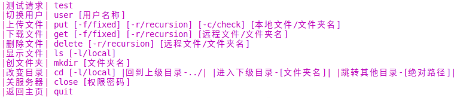

# httplib

制作人：陆颢万

## 项目简介

httplib是一个用C++实现的HTTP/HTTPS服务器/客户端开源项目。

我通过学习和参考该项目，给出了自己的HTTP/HTTPS服务器/客户端实现。

>参考项目地址：https://github.com/yhirose/cpp-httplib

## 项目要求

以下将介绍项目的相关要求。

### 服务器

- 通过解析配置文件（JSON格式）得到监听地址。

- 若当前用户为root，需要通过配置文件指定运行用户，否则以当前用户运行。

- 通过配置文件指定URL，处理器，处理器参数，如：{"url":"/data","handler":"data","params":{"dir":"/var/test/httplib/data"}}。

- 使用工厂模式创建对应的处理器。

- 实现一个读、写二进制文件内容（内容类型：application/octet-stream）的处理器，可处理定长（有Content-Length头部）及变长（chunked格式）的传输格式，该处理器通过上述配置的参数将请求对到指定目录中的文件，如/data/backup/ubuntu.iso按上述示例目录将对应到/var/test/httplib/data/backup/ubuntu.iso。

>chunked格式介绍：https://en.wikipedia.org/wiki/Chunked_transfer_encoding

- 支持多会话并发上传和下载，可通过配置文件指定最大并发数。

- 可通过配置文件指定keep-alive的次数。

### 客户端

- 可通过命令行参数指定一个本地目录作为测试数据，将该目录中的文件按相同的目录结构上传至服务器，再下载已上传成功的文件，校验数据是否正确（在下载的过程中对数据进行校验，不保存为文件）。

- 可通过命令行参数指定并发的会话数量，为每个会话创建一个独立线程，当超过服务端最大并发数时，排队进行重试。

- 小文件合并功能：当客户端上传的文件较小时（如小于1MB）将多个小文件合并保存为一或多个大文件，并通过一个key-value数据库保存每个小文件对应的大文件及在该文件中的偏移和大小。

- 目录列表功能：当客户端请求的URL对应到一个目录时，以自定义的JSON格式返回该目录的文件（及子目录）列表，包含文件的大小，修改时间等属性。

- 交互式客户端：类似一个FTP客户端，可连接到指定的服务端目录，进行交互式的列表，上传，下载。

## 项目收获

待定。

## 项目配置

### 文件目录树

```
httplib
│
├── config                    配置文件
│   │
│   ├── config.json           服务器配置文件
│   │
│   └── db_config.json        数据库配置文件
│
├── doc                       概要设计文档
│ 
├── README.md                 介绍文档
│
├── src                       源代码
│   │
│   ├── Client                客户端源代码
│   │
│   ├── include               项目所需库文件
│   │
│   └── Server                服务器源代码
│       │                     
│       └──server_log.json    服务器日志
│
├── test                      测试相关
│
└── .vscode                   VSCode相关配置
```

### 操作要求



默认设置是以变长格式下载、上传文件。

文件校验功能已集成至上传文件功能中，使用-c/-check可在上传后执行校验功能。

上传、下载、删除、创建新文件夹和更改路径等均支持以绝对路径和相对路径进行操作。

命令行界面支持左右键移动光标和上下键切换历史记录。

### 库配置要求

请先确保已安装库redis++和readline。

#### redis++库安装：

```
git clone https://github.com/redis/hiredis.git
cd hiredis
make
make install
cd ../
git clone https://github.com/sewenew/redis-plus-plus.git
cd redis-plus-plus
mkdir build
cd build
cmake ../
make
make install
```

>redis++参考网站：https://github.com/sewenew/redis-plus-plus

#### readline库安装：

```
sudo apt-get install libreadline-dev
```

### Json配置要求

Json文件在config文件夹内，其中config.json记录了服务器和处理器的相关参数。而db_config.json记录了数据库的相关参数。

### CMake配置要求-终端

#### 服务器

服务器的build文件夹应建立在Server文件夹内。在build中运行CMake后，可执行文件会生成在Server文件夹内。需要在Server文件夹路径下运行该可执行文件。

```
cd /httplib/src/Server/build
cmake ../
make
cd ../
./server
```

#### 客户端

客户端的build文件夹应建立在Client文件夹内。在build中运行CMake后，可执行文件会生成在Client文件夹内。需要在Client文件夹路径下运行该可执行文件。

```
cd /httplib/src/Client/build
cmake ../
make
cd ../
./client
```

### CMake配置要求-VSCode

#### 服务器

在VSCode中运行任务ServerRun即可，将会自动创建build文件夹，完成编译并运行。

需要多开服务器，可以通过VSCode的“运行和调试”运行server。

#### 客户端

在VSCode中运行任务ClientRun即可，将会自动创建build文件夹，完成编译并运行。

需要多开客户端，可以通过VSCode的“运行和调试”运行client。
