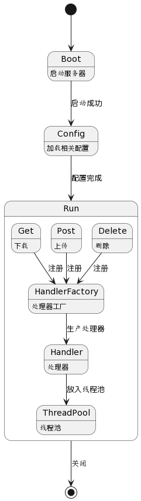
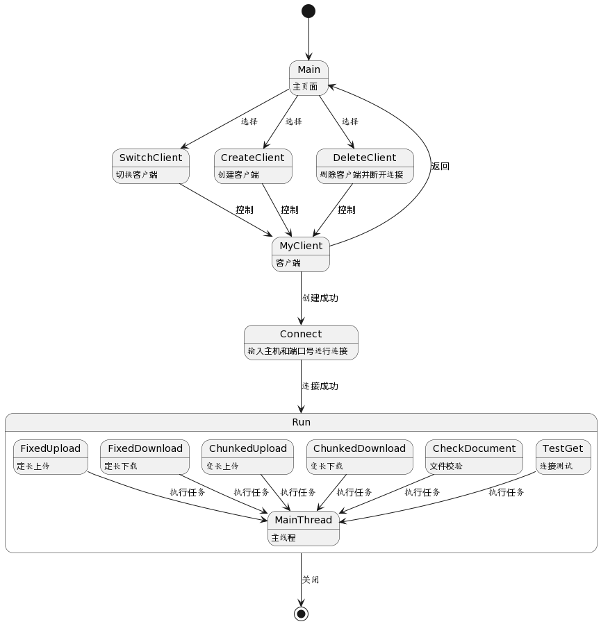

# 概要设计

## 1、引言

### 1.1 文档目的

本项目建立在cpp-httplib库学习的相关知识体系的基础上，以系统全面地应用所学知识为出发点，设计一个类FTP的文件传输系统，能够实现一个服务器以及类FTP的交互客户端，可连接到指定的服务端目录，进行交互式的列表、上传、下载。

本文档从功能需求的角度，详细地描述了项目开发的功能需求以及预期实现方法，为完成该项目提供了一个详细的功能需求说明文档。

### 1.2 文档范围

本文档描述了项目的功能需求，各个功能设计目标，概要设计目标，概要设计，设计约束及各种人机交互的格式要求。

### 1.3 文档对象

项目开发人员：陆颢万。

## 2、项目介绍

### 2.1 项目背景

本项目基于cpp-httplib库开发，该库特点是header only，使用时仅需包含头文件即可。通过对该项目的开发，能进一步提高开发者对http协议、线程池的实现、服务器和客户端交互等内容的掌握。

### 2.2 项目组成

#### 服务器
  
- 通过解析配置文件（JSON格式）得到监听地址。
  
- 若当前用户为root，需要通过配置文件指定运行用户，否则以当前用户运行。
  
- 通过配置文件指定URL、处理器、处理器参数、如：{"url":"/data","handler":"data","params":{"dir":"/var/test/httplib/data"}}。
  
- 使用工厂模式创建对应的处理器。
  
- 实现一个读、写二进制文件内容（内容类型：application/octet-stream）的处理器，可处理定长（有Content-Length头部）及变长（chunked格式）的传输格式，该处理器通过上述配置的参数将请求对到指定目录中的文件，如/data/backup/ubuntu.iso按上述示例目录将对应到/var/test/httplib/data/backup/ubuntu.iso。
  
>chunked格式介绍：https://en.wikipedia.org/wiki/Chunked_transfer_encoding
  
- 支持多会话并发上传和下载，可通过配置文件指定最大并发数。
  
- 可通过配置文件指定keep-alive的次数。
  
#### 客户端
  
- 可通过命令行参数指定一个本地目录作为测试数据，将该目录中的文件按相同的目录结构上传至服务器，再下载已上传成功的文件，校验数据是否正确（在下载的过程中对数据进行校验，不保存为文件）。
  
- 可通过命令行参数指定并发的会话数量，为每个会话创建一个独立线程，当超过服务端最大并发数时，排队进行重试。
  
- 小文件合并功能：当客户端上传的文件较小时（如小于1MB）将多个小文件合并保存为一或多个大文件，并通过一个key-value数据库保存每个小文件对应的大文件及在该文件中的偏移和大小。
  
- 目录列表功能：当客户端请求的URL对应到一个目录时，以自定义的JSON格式返回该目录的文件（及子目录）列表，包含文件的大小，修改时间等属性。
  
- 交互式客户端：类似一个FTP客户端，可连接到指定的服务端目录，进行交互式的列表，上传，下载。

### 2.3 项目运行环境

- Linux操作系统：Ubuntu 22.04

- 编译环境：g++5及以上

- 项目构建：Visual Stdio Code

## 3、数据结构设计

### 3.1 Json配置文件格式

```
{
	"runUser":"",
	"address":"",
	"port":"",
	"concurrencyLimit":3,
	"keepaliveLimit":5,
	"params":[
		{
			"url":"",
			"processor":"",
			"dir":""
		}
	]
}
```

### 3.2 目录列表结构

```
{
	"folder":[
		"file":{
			"size":5,
			"modified_time":"2023-7-22 09:03:00"
		},
		"folder":[
			"file":{
				"size":3,
				"modified_time":"2023-7-22 09:03:52"
			}
		]
	],
	"file":{
		"size":4,
		"modified_time":"2023-7-22 09:04:42"
	}
}
```

### 3.3 数据库设计

| 小文件名 | 大文件名 | 偏移量 | 文件大小 |
| ---------- | ---------- | ---------- | ---------- |
| file | Bigfile_1 | 3842 | 3967 |

## 4、功能性需求

| 模块名称 | 功能类别 | 功能说明 |
| ---------- | ---------- | ---------- |
| **客户端** | 客户端启动 | 本地云启动，初始化界面 |
| | 连接服务器 | 输入服务器ip地址，端口号，连接到服务器 |
| | 文件列表 | 获取本地指定目录的文件列表 |
| | 文件上传 | 上传文件到指定文件夹 |
| | 文件下载 | 从指定文件夹上下载文件 |
| | 文件校验 | 对要下载的文件进行文件校验 |
| | 本地下载文件管理 | 下载之后的文件应由本地文件夹管理 |
| **服务器** | 服务器启动 | 通过读取Json配置文件启动 |
| | 用户接入 | 接收客户端的连接，管理客户端信息 |
| | 各业务处理 | 处理客户端的各类型业务 |
| | 文件管理 | 对客户传输的文件进行管理 |
| | 并发负载 | 初始化指定数量的线程池 |
| | 数据库设计与应用 | 为实现小文件合并建立小文件与大文件的对应关系 |

## 5、非功能性需求

| 功能类别 | 功能说明 |
| ---------- | ---------- |
| 并发数要求 | 要求一台服务器能够承受指定数量的连接数接入 |
| 并发业务要求 | 要求一台服务器能承受一定数量的并发业务处理 |
| 通信架构 | 采用http协议进行进程间的通信 |
| 系统拓展性 | 能够在尽量不修改源代码的前提下拓展业务 |
| 系统安全 | 能识别非法操作并对非法操作发出警告 |

## 6、系统总体设计

### 6.1 系统总体结构（见UserCase.drawio）

### 6.2 服务器基础结构（见server_ClassGraph.drawio）

### 6.3 客户端基础结构（见client_ClassGraph.drawio）

### 6.4 流程图设计

#### 服务器

```
@startuml
[*]-->Boot
Boot-->Config :启动成功
Config-->Run :配置完成
Run-->[*] :关闭
Boot:启动服务器
Config:加载相关配置
state Run{
  Get:下载
  Post:上传
  Delete:删除
  Get-->HandlerFactory :注册
  Post-->HandlerFactory :注册
  Delete-->HandlerFactory :注册
  HandlerFactory-->Handler :生产处理器
  Handler-->ThreadPool :放入线程池
  HandlerFactory:处理器工厂
  Handler:处理器
  ThreadPool:线程池
}
@enduml
```



#### 客户端

```
@startuml
[*]-->Main
Main-->SwitchClient :选择
Main-->CreateClient :选择
Main-->DeleteClient :选择
CreateClient-->MyClient :控制
SwitchClient-->MyClient :控制
DeleteClient-->MyClient :控制
MyClient-->Main :返回
MyClient-->Connect :创建成功
Connect-->Run :连接成功
Run-->[*] :关闭
Main:主页面
SwitchClient:切换客户端
CreateClient:创建客户端
DeleteClient:删除客户端并断开连接
MyClient:客户端
Connect:输入主机和端口号进行连接
state Run{
  FixedUpload-->MainThread :执行任务
  FixedDownload-->MainThread :执行任务
  ChunkedUpload-->MainThread :执行任务
  ChunkedDownload-->MainThread :执行任务
  CheckDocument-->MainThread :执行任务
  TestGet-->MainThread :执行任务
  FixedUpload:定长上传
  FixedDownload:定长下载
  ChunkedUpload:变长上传
  ChunkedDownload:变长下载
  CheckDocument:文件校验
  TestGet:连接测试
  MainThread:主线程
}
@enduml
```



## 7、立项标准

### 7.1 开发周期要求

第一周~第二周：完成基础的概要设计，撰写概要设计文档，基本完成用例图和类图的绘画，代码上基本完成除具体实现外的类和参数的定义。

第三周：完成详细设计，包括模块划分、接口设计以及数据库的连接和使用等。

第四周~第六周：进行代码编写。

第七周：完成功能测试和异常处理测试，完善项目文档。

### 7.2 编码规范要求

以中文 Google C++ 风格指南为编码规范要求。
